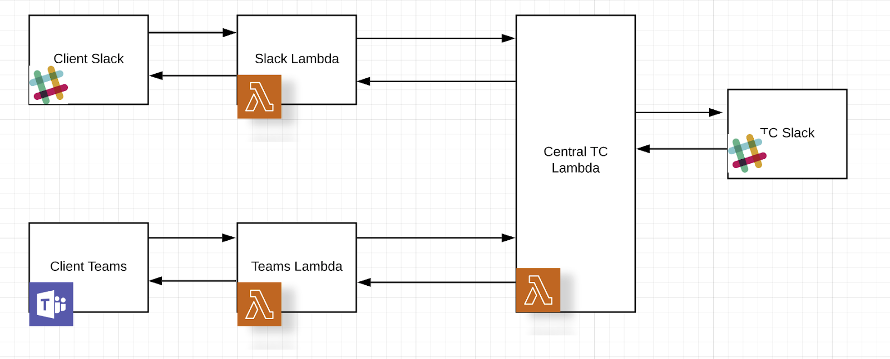

# Topbots

## Overview

Central TC acts as a bridge between TC Slack and Client Slack Lambda or Client MS Teams Lambda

## Local vs public settings
The 'local' column describes values for local development only.
The 'public' column describes values for deploying with the custom domain on AWS .
Some values are required in `serverless.xml`.These values are marked as <VALUE_REQUIRED>.
The value marked as <NOT_USED> might be set an empty string.

You need AWS Account to deploy TopBot on AWS. Sign Up & [create a new account](http://aws.amazon.com/).

**AWS_KEY_ID** - Go to your [AWS account overview](https://console.aws.amazon.com/). Account menu in the upper-right (has your name on it). Click on the `Security Credentials` sub-menu.
**AWS_SECRET_ACCESS_KEY**
**AWS_ACCOUNT_ID** - Go to your [AWS account overview](https://console.aws.amazon.com/). Account menu in the upper-right (has your name on it). Click on the `MyAccount` sub-menu.

| Name              	             | local               	       |  public             	| Description       	|
|----------------------------------- |---------------------------- |----------------------- |---------------------- |
| stage              	             | local  	                   |  dev         	        |   	                |
| region   	                         | us-east-1                   |  us-east-1             | AWS_REGION   	        |
| ACCESS_KEY_ID   	                 | DEFAULT_ACCESS_KEY          |  <VALUE_REQUIRED>      | AWS_KEY_ID  	        |
| SECRET_ACCESS_KEY  	             | DEFAULT_SECRET  	           |  <VALUE_REQUIRED>  	| AWS_SECRET_ACCESS_KEY |
| REGION   	                         | localhost  	               | ${self:custom.region}  |   	|
| DYNAMODB_ENDPOINT  	             | http://localhost:8000  	   | <NOT_USED>             |  	    |
| TC_SLACK_ADMIN_USER_TOKEN   	     | <VALUE_REQUIRED>  	       | <VALUE_REQUIRED>   	|   	|
| TC_SLACK_BOT_TOKEN  	             | <VALUE_REQUIRED>  	       | <VALUE_REQUIRED>   	|   	|
| TC_SLACK_CHANNEL   	             | general  	               | general   	            |    	|
| TC_SLACK_CLIENT_SIGNING_SECRET  	 | <VALUE_REQUIRED>   	       | <VALUE_REQUIRED>   	|   	|
| CLIENT_SLACK_CLIENT_ID   	         | <VALUE_REQUIRED>  	       | <VALUE_REQUIRED>   	|   	|
| CLIENT_SLACK_CLIENT_SECRET         | <VALUE_REQUIRED>  	       | <VALUE_REQUIRED>   	|   	|
| CLIENT_SLACK_CLIENT_SIGNING_SECRET | <VALUE_REQUIRED>  	       | <VALUE_REQUIRED>   	|   	|
| CLIENT_SLACK_ADD_TO_SLACK_BUTTON   | <VALUE_REQUIRED>  	       | <VALUE_REQUIRED>   	|   	|
| CLIENT_TEAMS_APP_ID           	 | <VALUE_REQUIRED>            | <VALUE_REQUIRED>   	|   	|
| CONNECT_BEARER_TOKEN 	             | <VALUE_REQUIRED>  	       | <VALUE_REQUIRED>   	|   	|
| SNS_ACCOUNT_ID  	                 | 123456789012  	           | <VALUE_REQUIRED>   	| AWS_ACCOUNT_ID   	|
| SNS_ENDPOINT  	                 | http://localhost:4000  	   | <NOT_USED>         	|       |
| **********  	                     |   	                       |                        |   	|
| custom  	                         |   	                       |   	                    |   	|
| **********  	                     |   	                       |                        |   	|
| lambda_uri  	                     | 'http://localhost:3000'     | <VALUE_REQUIRED>  	    | E.g. 'https://mysite.com' |
| domainName  	                     | <NOT_USED>  	               | <VALUE_REQUIRED>       | E.g. mysite.com  	|

## Deployment Guide

Follow instructions in [Deployment Guide](docs/DeploymentGuide.md) to deploy locally.

Follow instructions in [Deployment Guide With Custom Domain](docs/DeploymentGuideWithCustomDomain.md) to deploy in AWS Account.

## Verification Guide

Follow instructions in [Verification Guide](docs/VerificationGuide.md)

## Swagger documentation

TC Slack REST API's are documented in [swagger.yaml](docs/tc-slack/swagger/swagger.yaml)

Client Slack REST API's are documented in [swagger.yaml](docs/client-slack/swagger/swagger.yaml)

Clinet MS Teams REST API's are documented in [swagger.yaml](docs/client-teams/swagger/swagger.yaml)

## DynamoDB database description

1. Table `projects` has the following fields,

`id` (primary_key): Unique id for each project

`description`: Project description

`requester`: The name of the client user who initiates project request

`createdAt`: Timestamp at which the project was created

`status`: Current status of the project. It is one of LAUNCHED, RESPONDED, ACCEPTED, DECLINED or APPROVED. 

Why we need it: To handle scenarios like multiple clicks on buttons.

`clientSlackThread` (has an index - `client_slack_thread_index`): The thread id in client slack where the @topbot request command was initially invoked.

`clientSlackChannel`: The channel in client slack where the @topbot request command was initially invoked. The client can invoked this command in any channel so the combination of clientSlackThread and clientSlackChannel uniquely identify a request thread.

Why we need it: `clientSlackThread`, `clientSlackChannel`: These fields are used by Slack lambda to post a response to the right thread when `/approve` is called on it. It is also used to identify the project when an `email` command is issued. Without these fields we'd have no context of which thread to post responses to.

`slackTeam`: The team id of client slack workspace

Why we need it: To obtain the bot token used to communicate with client slack from the `slack_clients` table for this team.

`tcSlackThread`: Thread id in topcoder slack where the project request was initially posted by TC Central.

Why we need it: This is used to post messages to TC Slack when routes `/accept` or `/decline` or `/invite` is called. Also used during dialog submission. Without it we'd have no context of which thread to post responses to.
There is no need to store tcSlackChannel as it is fixed.

`teamsConversationId`: Conversation id in MS Teams where the @topbot request command was initially invoked. Conversation id is a combination of channel id and message id so we don't need an additional teams field to store channel information (like `clientSlackChannel`)

Why we need it: This field is used by Teams lambda to identify the project when an `email` command is issued. Without this field we'd have no way to identify which conversation to post responses to.

`platform`: Supported messageing platforms. Currently it can be either `slack` or `teams`. It is used to differentiate requests from Client Slack and Client MS Teams.

2. Table `slack_clients` has the following fields:

`teamId`: The id of the team. This is the primary key used to identify the team in which the bot is installed.

`userId`: User id of the user who installed the bot into the team

`userToken`: Encrypted access token of the user

`botToken`: Encrypted access token of the bot. It is used to post messages to client slack.

## Existing issue

When submitting a dialog response you might intermittently see an error such as https://monosnap.com/file/fkd5lWcjP8H4lOP8ozxrPcX4EOEEyc

The reason is that Slack expects a response within 3 seconds but since we're using lambda we can only return from a function after all our operations complete

These operations might take more than 3 seconds at times

The solution seems to be to have one lambda function call another using something like AWS SNS

See https://stackoverflow.com/questions/31714788/can-an-aws-lambda-function-call-another
