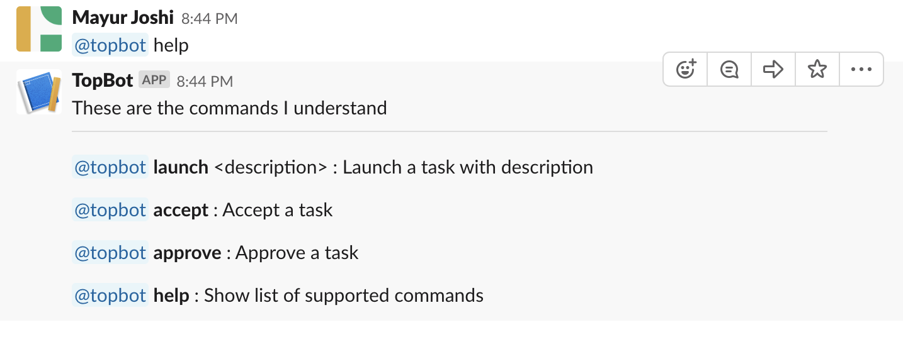

# TopBot
## Local setup

### Prerequisites

1. Node.js v10.14.2 or higher. Download link: https://nodejs.org/en/download/

2. ngrok. Download link: https://ngrok.com/download

3. Slack account

4. Mongodb community edition. Download link: https://www.mongodb.com/download-center/community

### How to run

1. Start ngrok and obtain a https url. `./ngrok http 3000`.

2. Make sure you have `/data/db` directory created with write access to current user. Start mongodb `mongod`. Create a database, say `topbot`.

3. Login to slack and create a channel to post tasks to. Update the name of this channel in `config/default.js -> CHANNEL_TO_POST_TASKS` (make sure to include the '#')

4. The instructions here, https://botkit.ai/docs/provisioning/slack-events-api.html are really comprehensive. You can follow steps 1 to 6 and ignore step 2. 
In step 3 (Configure OAuth), make sure to add the `channels.write` scope and click `Save changes`.
In steps 5 and 6 add your api prefix (found in `config/default.js -> API_PREFIX`) before `/slack/receive`. Your URL should look like this
``https://YOURURL/v5/topbot/slack/receive`` 

  

5. Before step 7, go to the `Basic information` tab of your app. Collect these values from `App credentials` section, `Client id`, `Client secret`, `Signing Secret`.

  

6. Update `.env` file with the information from above steps.

    

7. Start your node app. `npm i` followed by `npm start`.

8. Now follow step 7. i.e open the ngrok url on a browser.

9.  On the home page of the `ngrok` url, click `Add to Slack`.

  

10. Click `Authorize` on the next page.

  

11. You will recieve a bot added message.

  

12. **IMPORTANT** Before proceeding further, go to the `OAuth and permissions` page of you bot. (From step 3, Configure OAuth). You will see a banner saying permissions have changed. Reinstall the app by clicking `click here`. Authorize on the following page.

  

  

13. Now you can follow "Testing" section .

## Testing

1. Invite the bot, `/invite @topbot`. You will see a welcome message in your channel. The bot is also automatically added to the channel for tasks if it is not already a member.
You will see a welcome message on tasks channel if it is a fresh add. This is to notify all members of task channel who are not a part of main channel that a bot is availabe.
   
    

2. Issue `help` command, `@topbot help`. You will see a list of commands supported by the bot.
   
    

3. Launch a task. `@topbot launch Horizon - Create New Project Mock API Integration - Part 2`. You will see a message posted in channel that you selected before
   
    

4. Accept this task as another user by clicking the `Start a thread` and then reply `@topcoder accept`
   
   
   
    

5.  A new channel will be created with the name `<first_15_characters of task description>__<taskUUid>`. The uuid is added to avoid conflicts incase two tasks have similar descriptions. Slack limits channel names to 21 characters.
  
  The channel will have two users, task's launcher and person who accepted this task. The bot will also automatically be added.

6. As task's launcher, approve the task inside the newly created channel. `@topbot approve`. You will see a confirmation message.
 
      

There are several error scenarios which the bot handles. These are,

1. `launch` task with no description

  

2. `accept` command in a non thread.
 
    

3. `accept` a task which is already accepted.
 
    

4. `accept` in a thread but not for a launched task.
    
    

5. `accept` a task launched by the same user

    

6. `approve` in a channel which is not the one created for a task.

    

7. `approve` task as a user who did not launch the task

    

8. `approve` task which is already approved as a launcher

    
    
### App comfiguration

Configuration is defined in `config/default.js`. The comments there explain each field.
You need to get team and channel id where you want to send your requests and paste them in "TEAM_TO_POST" and "CHANNEL_TO_POST" config variables

### Linting

Run `npm run lint`

### Other important notes

1. `Signing Secret` is very important for security. So make sure to update that field too in the `.env` file if not already. It is used to verify that the incoming messages from slack to the bot are indeed from slack and not from an attacker. This check happens in, `component/routes/incoming_webhooks.js`

2. Logs are written to files, `combined.log` for all logs and `error.log` for errors by winston.

3. Tasks are created in the `tasks` collection in MongoDB.
