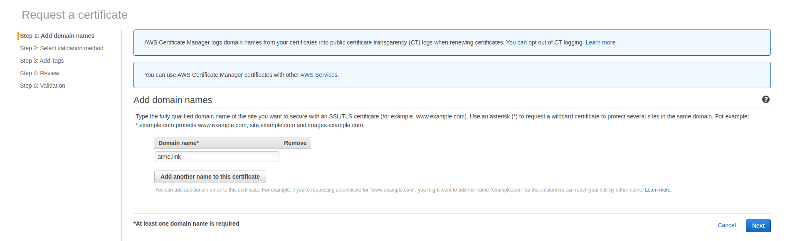

# Deploy with a custom domain in AWS Account
Follow this guide if you need to deploy it with a custom domain in AWS account.
In short, it includes 3 steps:
- setting up the domain in AWS account (Route53, hosted zones, SSL certificate, etc)
 This is the manual steps that need to be done only once for a top level domain.
- setting up a domain name for API Gateway during deployment
- deploying it in AWS Account

## Prerequisite
1. Node.js >= v12.14.1
2. You need AWS Account.

## Environment file
You should use the 'dev' stage  for the development. The environment file called '.env.dev' will be used.
You should enter all required parameters in this files. Don't change any values in serverless.xml.
You can create an env file'.env.mystage' and run all commands with the '--stage=mystage' option.
Don't name your stage as 'local' it's reserved for local development.

## Register a custom domain name

1. You must have a registered internet domain name in order to set up custom domain names for your APIs.
- you can register an internet domain using Amazon Route 53
- you can also transfer the registration for existing domains from other registrars to Route 53 or transfer the registration
for domains that you register with Route 53 to another registrar using a third-party domain registrar of your choice.

So I purchased a new domain through Route 53. When domain registration is complete, use `Route 53` as the DNS service for the domain.<br/>
`Route 53` – In the hosted zone that Route 53 created when you registered the domain, create records to tell Route 53 how you want to route traffic for the domain and subdomains.

Go to [Register a domain](https://console.aws.amazon.com/route53/home?#DomainListing:).<br/>
Go to [Transfer a domain](https://docs.aws.amazon.com/Route53/latest/DeveloperGuide/registrar.html)


## Create/Import SSL/TLS certificate
Before setting up a custom domain name for an API, you must have an SSL/TLS certificate ready in AWS Certificate Manager.
The following steps describe how to get this done. <br/>
To set up the certificate click on [Request a public certificate](https://console.aws.amazon.com/acm/home?region=us-east-1#/wizard/)



Add the domain name you want and click on `Next`, then choose a DNS validation method.
You might add a tag if you want, click on `Review` and click `Confirm and request`. After you confirm, it will say that a confirmation email has been sent to the registered owner of the domain to confirm the certificate. At this point, the certificate will be in a "Pending validation" status.


Click on your domain to expand content, click on `Create record in Route S3`. The popup window with the `Create record in Route 53`
will be displayed. Click on `Create`.


The registered owner of your domain will get a confirmation email from AWS. Click the link in the email to confirm issuance of the certificate. Once you do that, the certificate will change to an "Issued" status.


## Configure and deploy Slack bots

### Before start configuring and deploying bots
You need to install and configure Serverless:
1. Install Serverless using the command:
`npm install -g serverless`
2.Configure Serverless with your AWS Credentials:
`serverless config credentials --provider aws --key <AWS_ACCESS_KEY_ID> --secret <AWS_SECRET_ACCESS_KEY> --profile bot-dev`
3. Go to the root folder of the project and run `npm install` to get all dependencies.

### Create a custom domain in API Gateway
1. Open the environment file
2. Set the stage and replace the <domain_name> value with the domain name that you've configured your certificate for:
For example, my domain name is 'atme.link'
```
CUSTOM_DOMAIN_NAME=atme.link
```

If you're using a certificate that doesn't exactly match your domain name, such as a wildcard certificate,
you'll need to specify the certificate name with a certificateName property.
```
CUSTOM_DOMAIN_NAME=atme.link
CUSTOM_DOMAIN_CERTIFICATE_NAME=
```

2. Create your custom domain with a single command:
`sls create_domain --stage dev`

Example of the output:
```Serverless: Custom domain atme.link was created.
New domains may take up to 40 minutes to be initialized.
```
It generally takes 10-20 minutes.

### AWS parameters
You must set the next AWS parameters in the environment file before deploying.

REGION=
ACCOUNT_ID=
ACCESS_KEY_ID=
SECRET_ACCESS_KEY=

### TC Slack bot parameters
You must set the TC Slack parameters in serverless.xml before deploying.
Go to TC Slack Deployment Guide to find how get these values and updates `serverless.xml`.
You need only the section:
- [`Pre Deployment Configuration`](./tc-slack/DeploymentGuide.md)

We'll continue configuring TC Slack after deploying in AWS Account.

### Client Slack bot parameters
You must set the Client Slack parameters in serverless.xml before deploying if you want to use Client Slack bot.
Go to Client Slack Deployment Guide to find how get these values and updates `serverless.xml`.
You need to do only this section.
- [`Pre Deployment Configuration`](./client-slack/DeploymentGuide.md)

We'll continue configuring Client Slack after deploying in AWS Account.

### MS Teams bot parameters
You must set the MS Teams parameters in serverless.xml before deploying if you want to use MS Team bot.
Go to MS Teams Deployment Guide to find how get these values and updates `serverless.xml`.
You need to do only this section.
- [`Pre Deployment Configuration`](./client-teams/DeploymentGuide.md)

We'll continue configuring Client MS Team after deploying in AWS Account.


### Deploying in AWS

1. Once your domain name is ready, you can start deploying:
2. Run `sls deploy --stage dev` again to deploy your service.
Example of output:

```
Serverless: Packaging service...
Serverless: Excluding development dependencies...
Serverless: Creating Stack...
Serverless: Checking Stack create progress...
........
Serverless: Stack create finished...
Serverless: Uploading CloudFormation file to S3...
Serverless: Uploading artifacts...
Serverless: Uploading service BotLambda.zip file to S3 (50.94 MB)...
Serverless: Validating template...
Serverless: Updating Stack...
Serverless: Checking Stack update progress...
................................................................................................................................................................................................................................................................................................................................................................................
Serverless: Stack update finished...
Service Information
service: BotLambda
stage: dev
region: us-east-1
stack: BotLambda-dev
resources: 100
api keys:
  None
endpoints:
  POST - https://lghp22mrkg.execute-api.us-east-1.amazonaws.com/dev/tc-slack/events
  POST - https://lghp22mrkg.execute-api.us-east-1.amazonaws.com/dev/tc-slack/interactive
  POST - https://lghp22mrkg.execute-api.us-east-1.amazonaws.com/dev/client-slack/events
  POST - https://lghp22mrkg.execute-api.us-east-1.amazonaws.com/dev/client-slack/interactive
  POST - https://lghp22mrkg.execute-api.us-east-1.amazonaws.com/dev/tc-slack/request
  POST - https://lghp22mrkg.execute-api.us-east-1.amazonaws.com/dev/tc-slack/accept
  POST - https://lghp22mrkg.execute-api.us-east-1.amazonaws.com/dev/tc-slack/decline
  POST - https://lghp22mrkg.execute-api.us-east-1.amazonaws.com/dev/tc-slack/invite
  POST - https://lghp22mrkg.execute-api.us-east-1.amazonaws.com/dev/client-slack/response
  POST - https://lghp22mrkg.execute-api.us-east-1.amazonaws.com/dev/client-slack/approve
  GET - https://lghp22mrkg.execute-api.us-east-1.amazonaws.com/dev/client-slack/signin
  GET - https://lghp22mrkg.execute-api.us-east-1.amazonaws.com/dev/client-slack/auth/redirect
  POST - https://lghp22mrkg.execute-api.us-east-1.amazonaws.com/dev/client-teams/events
  POST - https://lghp22mrkg.execute-api.us-east-1.amazonaws.com/dev/client-teams/response
  POST - https://lghp22mrkg.execute-api.us-east-1.amazonaws.com/dev/client-teams/approve
functions:
  tc_slack_events: BotLambda-dev-tc_slack_events
  tc_slack_interactive: BotLambda-dev-tc_slack_interactive
  client_slack_events: BotLambda-dev-client_slack_events
  client_slack_interactive: BotLambda-dev-client_slack_interactive
  tc_slack_request: BotLambda-dev-tc_slack_request
  tc_slack_sns_events: BotLambda-dev-tc_slack_sns_events
  tc_slack_sns_interactive: BotLambda-dev-tc_slack_sns_interactive
  tc_slack_accept: BotLambda-dev-tc_slack_accept
  tc_slack_decline: BotLambda-dev-tc_slack_decline
  tc_slack_invite: BotLambda-dev-tc_slack_invite
  client_slack_sns_events: BotLambda-dev-client_slack_sns_events
  client_slack_sns_interactive: BotLambda-dev-client_slack_sns_interactive
  client_slack_response: BotLambda-dev-client_slack_response
  client_slack_approve: BotLambda-dev-client_slack_approve
  client_slack_signIn: BotLambda-dev-client_slack_signIn
  client_slack_auth: BotLambda-dev-client_slack_auth
  client_teams_events: BotLambda-dev-client_teams_events
  client_teams_sns_events: BotLambda-dev-client_teams_sns_events
  client_teams_response: BotLambda-dev-client_teams_response
  client_teams_approve: BotLambda-dev-client_teams_approve
layers:
  None
Serverless: Created basepath mapping.
Serverless Domain Manager Summary
Domain Name
  atme.link
Distribution Domain Name
  Target Domain: d1ajszhc4voqy3.cloudfront.net
  Hosted Zone Id: Z2FDTNDATAQYW2
Serverless: Run the "serverless" command to setup monitoring, troubleshooting and testing.
```
3. Need to complete the configuration

    Go to TC Slack Deployment Guide to complete the configuration:
    - ['Post Deployment Configuration' section](./tc-slack/DeploymentGuide.md)

    Go to Client Slack Deployment Guide to complete the configuration:
    - ['Post Deployment Configuration' section](./client-slack/DeploymentGuide.md)

    Go to Client MS Teams Deployment Guide to complete the configuration:
    - ['Post Deployment Configuration'](./client-teams/DeploymentGuide.md)

Done! Go to verification steps.

## Remove resources from AWS Account
Use the command `sls remove --stage dev` to remove all services(DynamoDB, SNS topics and so on)
from AWS.

Use the command `sls delete_domain --stage dev` to remove the created custom domain.
