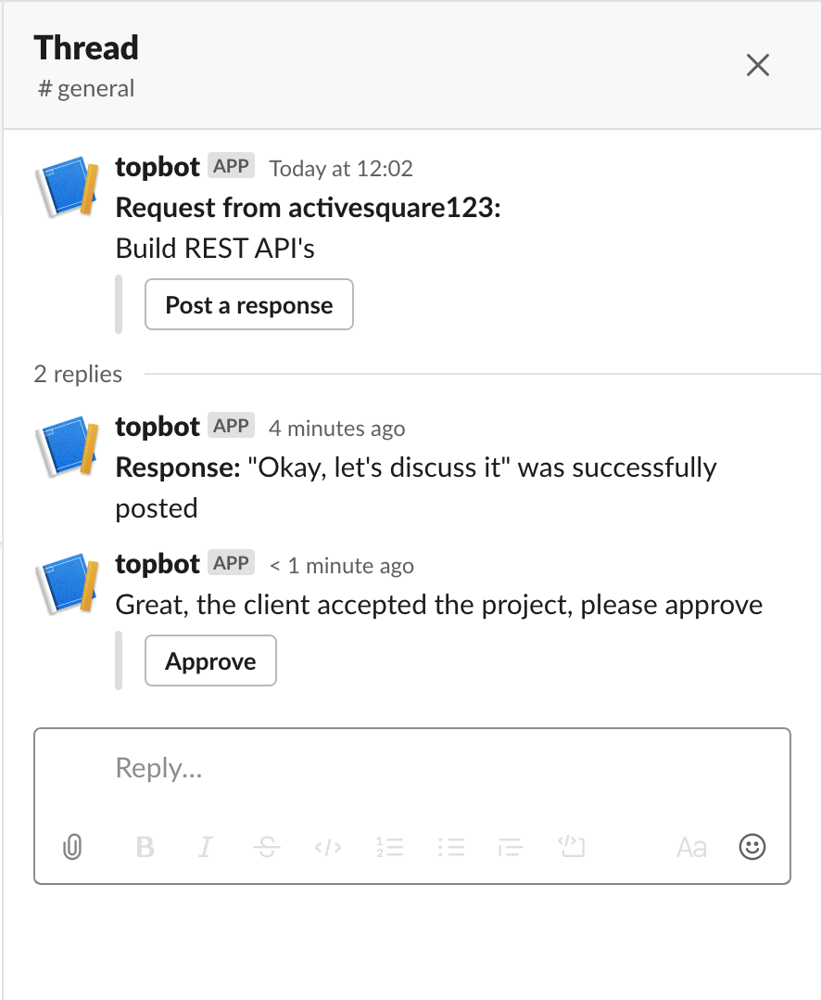
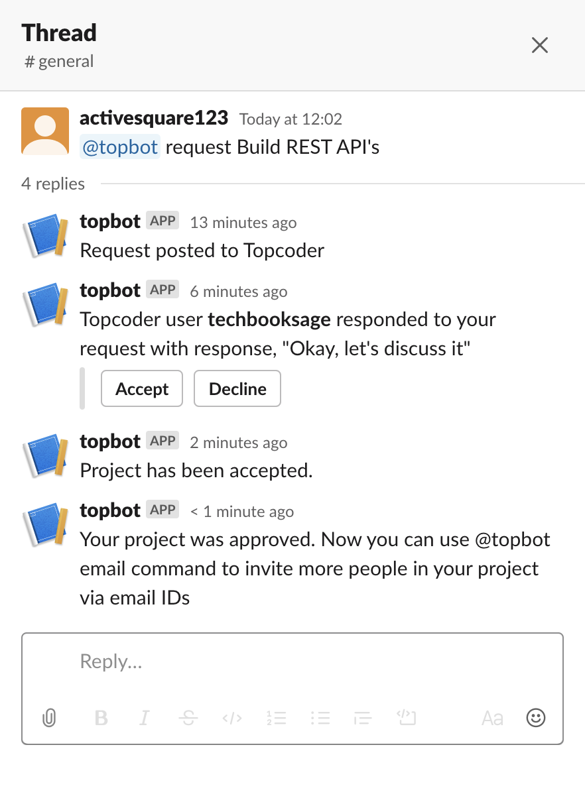

# Verification Guide

## Prerequisites

1. All steps in [Deployment Guide](DeploymentGuide.md) are completed

2. Postman

## Verification

When everything is setup from Deployment Guide, you will have two users. One is the `USER` who created the slack workspace and the slack bot. The other is the `NEW_USER` who was added to the channel using the invite link.

For verification, we'll use, 

1. `USER` to launch a task

2. `NEW_USER` to accept a task

3. `USER` to approve a task

4. `USER` and `NEW_USER` to run help command

### Launch a task

1. Get the `USER` member id by clicking on your workspace -> `Profile & Account` -> `Three vertical dots` in the side pane -> `Copy member ID`

This will be your `USER_ID`

2. Load the [postman collection](postman/central_tc.postman_collection.json) and the [postman environment](postman/central_tc.postman_environment.json) into postman

3. Update the environment variable `user` and set its current value to `USER_ID`

4. Run the `Launch` request. 

5. You will see a new database entry in `tasks` table and the task request is posted to the slack channel

### Accept a task

1. Login to the workspace as `NEW_USER`, reply `@topbot accept` to the task launched in a thread

2. A new channel will be created and `USER`, `NEW_USER` and `topbot` will be added to it

### Approve a task

1. In the new channel that is created, as `USER`, type in `@topbot approve`

2. You will see an acknowledgement message, "Great! We'll get your work done"

### Help command

1. As `USER` or `NEW_USER` type in `@topbot help` in a channel where the bot is a member

2. You will see the list of supported commands

## Error scenarios

There are several error scenarios which the bot handles. These are,

1. `accept` command in a non thread.
 
    

2. `accept` a task which is already accepted.
 
    

3. `accept` in a thread but not for a launched task.
    
    

4. `accept` a task launched by the same user

    

5. `approve` in a channel which is not the one created for a task.

    

6. `approve` task as a user who did not launch the task

    

7. `approve` task which is already approved as a launcher

    