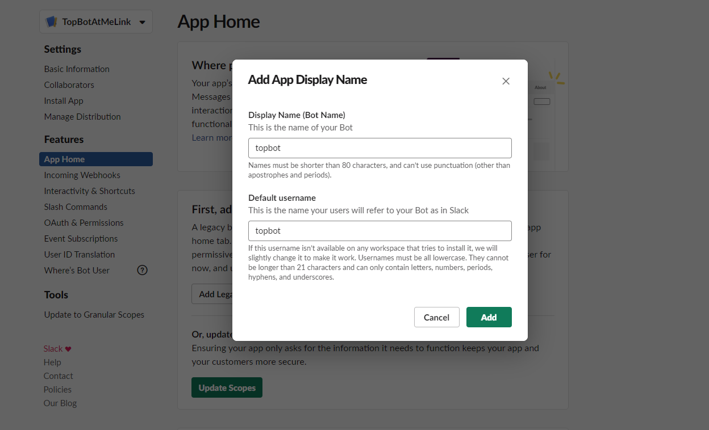
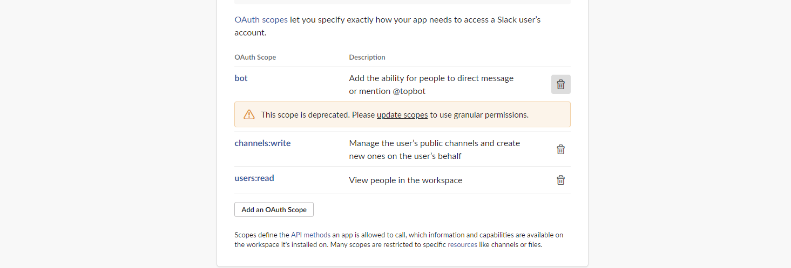
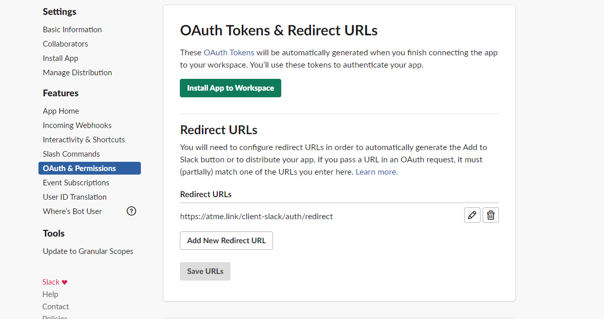
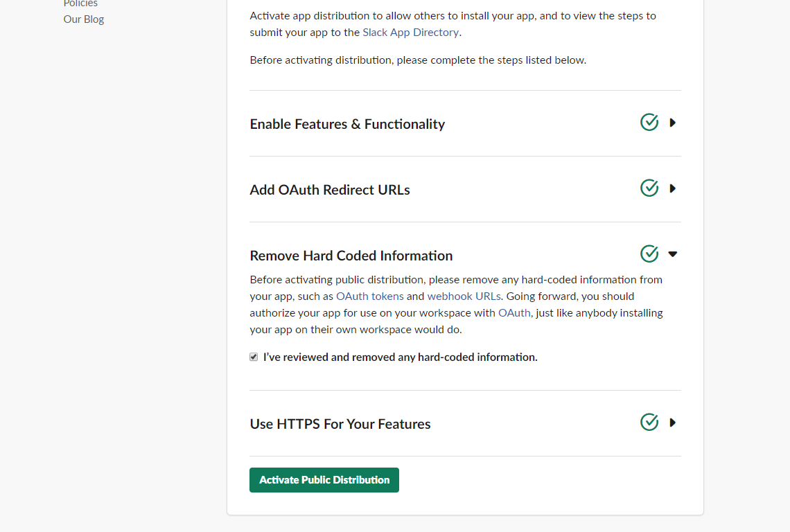

# Client Slack Deployment Guide

## Pre Deployment Configuration
You should use your custom domain instead of `NGROK_OR_CUSTOM_URL` for AWS Account deployment.
You should use your ngrok domain instead of `NGROK_OR_CUSTOM_URL` for local deployment.

1. Open the create app page, click [here](https://api.slack.com/apps?new_classic_app=1)

2. Provide a name and select a workspace (This represents the Topcoder workspace)

3. **ENV** Go to app credentials from `Settings` -> `Basic Information`.
Update your env file with the the values,
Client id -> `CLIENT_SLACK_CLIENT_ID`
Client secret -> `CLIENT_SLACK_CLIENT_SECRET`
Signing Secret -> `CLIENT_SLACK_CLIENT_SIGNING_SECRET`

(**Make sure to use quotes around CLIENT_SLACK_CLIENT_ID**)

4. Click on `Features` -> `App Home` -> `Add Legacy Bot User`. Provide a name say, `topbot` and click `Add Bot User`

5. Click on `OAuth & Permissions` in the menu, Click `Add an OAuth  Scope` and Add scope `bot`, `channels:write` and `users:read` and click `Save changes`.

**Do not install the app into workspace. This app is meant to be installed in client workspace and not Topcoder workspace.**

6. Click on `Features` -> `OAuth & Permissions`, go to `Redirect URL's` -> `Add new redirect url`, provide value
`NGROK_OR_CUSTOM_URL/client-slack/auth/redirect` and click save.

7. Click on `Manage distribution` menu item.

**ENV** Copy the html code provided in the Embeddable Slack Button box and paste it into
the env file -> `CLIENT_SLACK_ADD_TO_SLACK_BUTTON`.

Then click on `Remove Hard Coded Information` and check it. The `Activate Public Distribution` button should now become enabled. Click it.

## Post Deployment Configuration
This section helps to complete configurations for local deployment and AWS Account deployment.
You should use your custom domain instead of `NGROK_OR_CUSTOM_URL` for AWS Account deployment.
You should use your ngrok domain instead of `NGROK_OR_CUSTOM_URL` for local deployment.

### Enable event subscriptions in Slack app

1. Go to https://api.slack.com/apps and click on the app that you created earlier in `Create a Slack App`

2. Click on `Features` -> `Event Subscriptions`. Turn it on.

3. Go to `Subscribe to Bot Events` section and add `app_mention` event. (See the image below)

4. Scroll up and provide a `Request URL`. Provide value `NGROK_OR_CUSTOM_URL/client-slack/events` and click `Save changes` once verified.

### Enable interactive components in Slack app

1. Go to https://api.slack.com/apps and click on the app that you created earlier in `Create a Slack App`

2. Click on `Features` -> `Interactive Components`. Turn it on and fill in `NGROK_OR_CUSTOM_URL/client-slack/interactive` into the `Request URL` field. Click Save changes.

