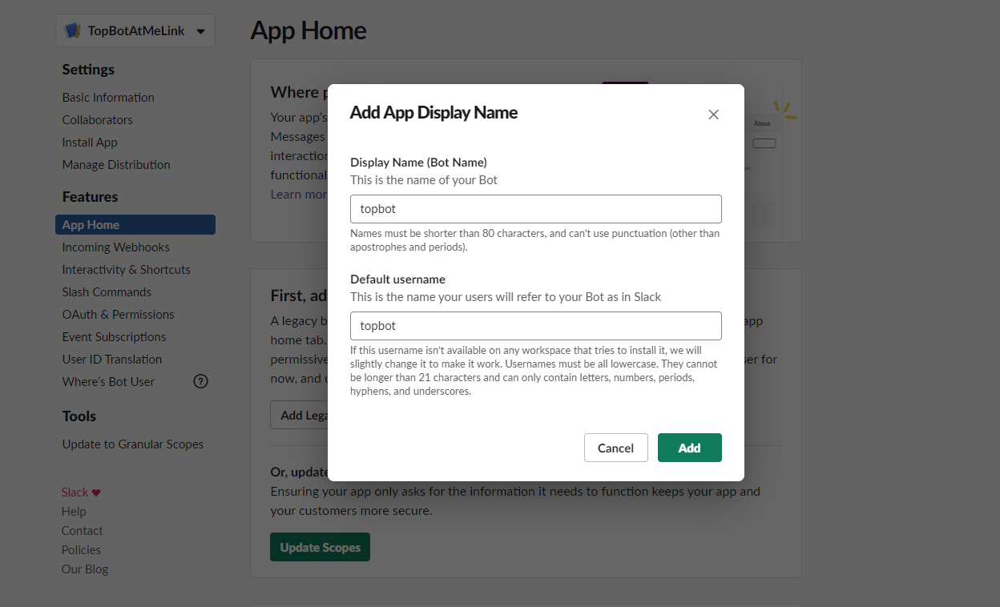

# TC Slack Deployment Guide

## Pre Deployment Configuration

### Create a slack account

1. Create a slack account if you don't have one already. Click `Create a new workspace` [here](https://slack.com/get-started).

2. Provide an email address and click confirm

3. A verification code will be sent to your email, post the verification code back to the slack setup page

4. Create a team and a project

5. Click `Skip for now` if you don't want to add more users


6. You should see your team and your channel created


**ENV** In the list of Channels in your workspace, pick one and provide its name in the `provider:environment:TC_SLACK_CHANNEL` field in `serverless.yml`. This will be the channel to which new task requests will be posted

### Create a Slack App

1. Open the create app page, click [here](https://api.slack.com/apps?new_classic_app=1)

2. Provide a name and select a workspace


3. **ENV** Go to app credentials from `Settings` -> `Basic Information`. Get the value of `Signing Secret` and provide
it in `TC_SLACK_CLIENT_SIGNING_SECRET` field in the env file.


4. Click on `Features` -> `App Home` -> `Add Legacy Bot User`. Provide a name say, `topbot` and click `Add Bot User`



5. Click on `Features` -> `OAuth & Permissions` -> `Install App to Workspace`


6. Click `Allow`


7. Click on `OAuth & Permissions` in the menu, click on `Add an OAuth Scope`  and add `channels:write`  and click `Reinstall App` by clicking the link on the top banner.


8. **ENV** On success, you will see your `OAuth Access Token` and
 `Bot User OAuth Access Token` in `OAuth Tokens & Redirect URLs`.

 Copy `OAuth Access Token` and provide it in `TC_SLACK_ADMIN_USER_TOKEN` field in the env file.

 Copy `Bot User OAuth Access Token` and provide it in `TC_SLACK_BOT_TOKEN` field in the env file.

9. **ENV** Provide connect bearer token in the env file -> `CONNECT_BEARER_TOKEN`.
You may login to `http://connect.topcoder-dev.com` and find the Bearer token in the request headers using browser dev tools.

12. All the required environment values in the env file should be filled now. It should look something like,

```
    # TC Slack bot configuration
    TC_SLACK_ADMIN_USER_TOKEN=
    TC_SLACK_BOT_TOKEN=
    TC_SLACK_CHANNEL=general
    TC_SLACK_CLIENT_SIGNING_SECRET=
    # Topcoder connect configuration
    CONNECT_BEARER_TOKEN=
```

## Post Deployment Configuration
This section helps to complete configurations for local deployment and AWS Account deployment.
You should use your custom domain instead of `NGROK_OR_CUSTOM_URL` for AWS Account deployment.
You should use your ngrok domain instead of `NGROK_OR_CUSTOM_URL` for local deployment.

### Enable event subscriptions in Slack app

1. Go to https://api.slack.com/apps and click on the app that you created earlier in `Create a Slack App`

2. Click on `Features` -> `Event Subscriptions`. Turn it on.

3. Go to `Subscribe to Bot Events` section and add `app_mention` event. (See the image below)

4. Scroll up and provide a `Request URL`. Provide value `NGROK_OR_CUSTOM_URL/tc-slack/events` and click `Save changes` once verified.


### Enable interactive components in Slack app

1. Go to https://api.slack.com/apps and click on the app that you created earlier in `Create a Slack App`

2. Click on `Features` -> `Interactive Components`. Turn it on and fill in `NGROK_OR_CUSTOM_URL/tc-slack/interactive` into the `Request URL` field. Click Save changes.


